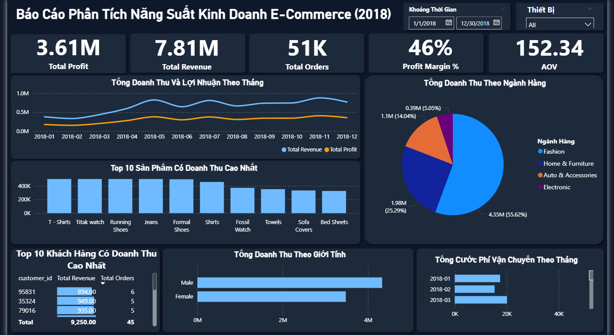
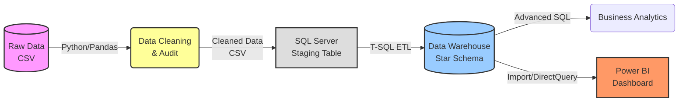
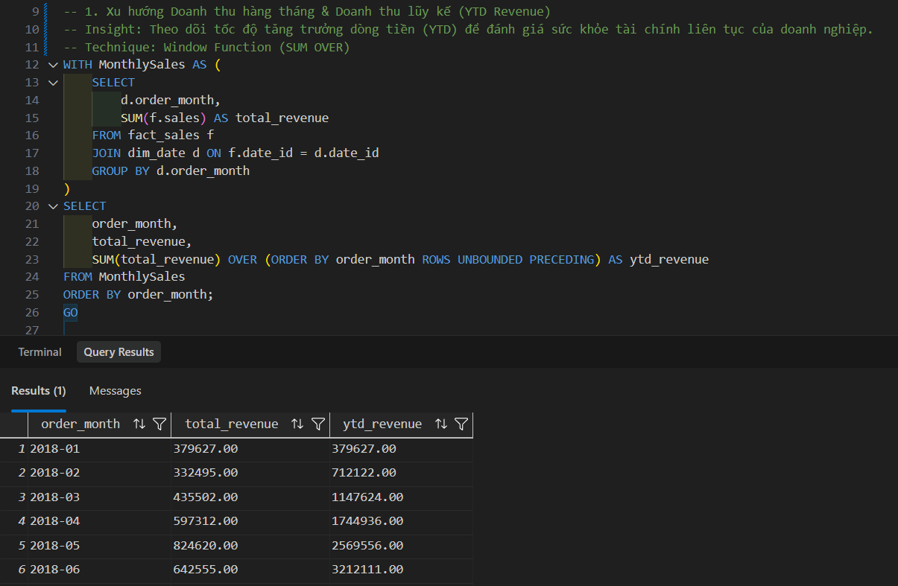
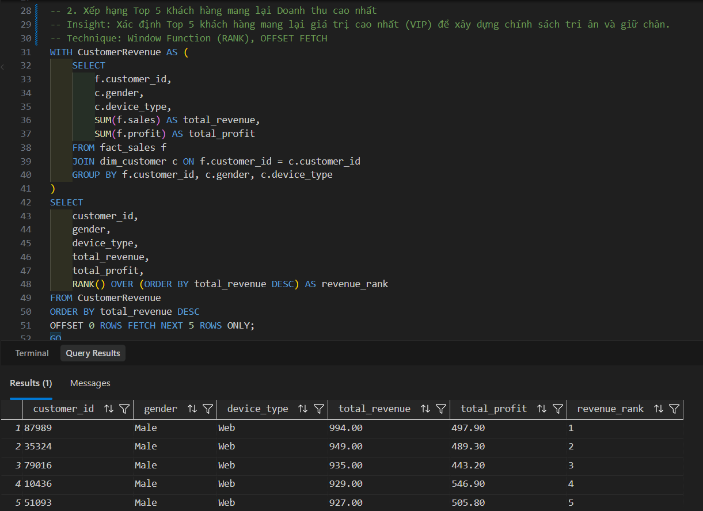
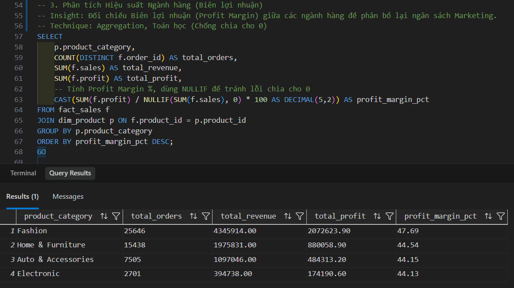
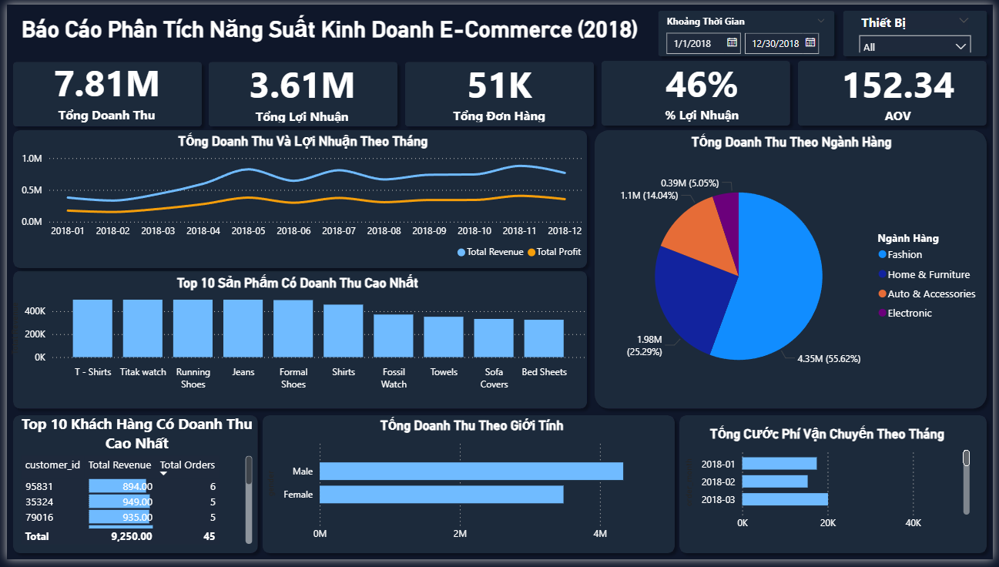
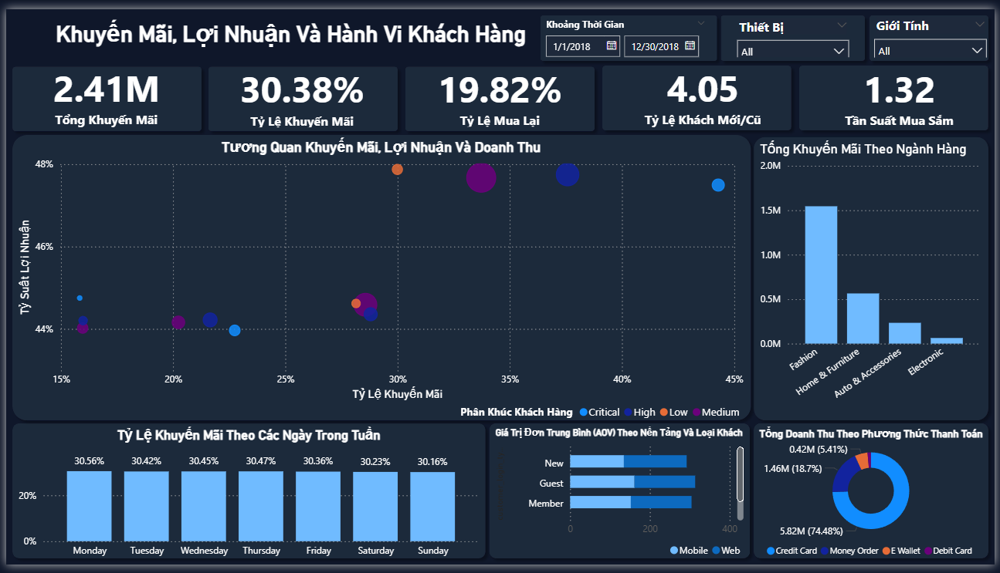

# **🛍️ Phân Tích Dữ Liệu & Hành Vi Khách Hàng E-Commerce (End-to-End Analytics)**




## **🔎 1. Tổng quan dự án (Project Overview)**

Dự án này là một **giải pháp phân tích dữ liệu toàn diện (Full-Stack Data Solution)** cho doanh nghiệp thương mại điện tử dựa trên tập dữ liệu lịch sử năm 2018 (hơn 51,000 đơn hàng). Quy trình triển khai chuyên nghiệp và khép kín qua 5 trụ cột cốt lõi:

| Trụ cột | 1. Xử lý Dữ liệu (Python) | 2. Xây dựng Data Warehouse | 3. SQL Advanced Analytics | 4. ML Customer Segmentation | 5. Power BI Dashboard |
| :--- | :--- | :--- | :--- | :--- | :--- |
| **Công cụ** | Pandas, Jupyter Notebook | SQL Server, T-SQL, ETL, 3NF | Window Functions, CTE | Scikit-Learn, K-Means, Plotly | Power BI, DAX, Dark-Mode UI |

### **Sơ đồ luồng dữ liệu (Data Pipeline Architecture)**



> 💡 **Lưu ý dành cho Nhà tuyển dụng / Technical Reviewer:**
> File `README.md` này đóng vai trò là **Báo cáo tổng quan**. Bạn có thể truy cập chi tiết mã nguồn và tài liệu từng phần thông qua bảng liên kết nhanh dưới đây:

| Phân khu | Mô tả chi tiết | Liên kết nhanh |
| :--- | :--- | :--- |
| **1. Dữ liệu (Data)** | Cấu trúc dữ liệu thô (raw) và sạch (cleaned) | [data/](./data/) |
| **2. Kiến trúc Pipeline** | Từ điển dữ liệu, sơ đồ ERD, luồng ETL, thiết kế Star Schema 3NF | [DATA_PIPELINE.md](./DATA_PIPELINE.md) |
| **3. Data Prep & Audit**| File Python làm sạch dữ liệu, báo cáo Business Insights | [notebooks/](./notebooks/) |
| **4. Advanced Analytics** | Mã SQL tạo Schema chuẩn 3NF, xử lý nghiệp vụ và truy vấn KPI | [sql/](./sql/) |
| **5. ML Segmentation** | Pipeline K-Means Clustering, RFM Analysis và hồ sơ phân cụm khách hàng | [machine_learning/](./machine_learning/) |
| **6. Power BI Dashboard**| File Dashboard .pbix và Hướng dẫn thiết kế Premium UI/UX | [dashboard/](./dashboard/) |

---

## **🎯 2. Mục tiêu dự án (Objectives)**

*   **Làm sạch & Kiểm toán Dữ liệu:** Xử lý triệt để các giá trị thiếu (missing values), dữ liệu rác từ tập dataset thô bằng Python (Pandas) để đảm bảo chất lượng dữ liệu đầu vào.
*   **Xây dựng Kho dữ liệu (Data Warehouse):** Thiết kế mô hình dữ liệu quan hệ (Star Schema) và phát triển kịch bản ETL tự động đẩy dữ liệu từ CSV vào SQL Server.
*   **Phân tích Kinh doanh Đa chiều:** Truy xuất các chỉ số tài chính, tối ưu vận hành và hành vi mua sắm thông qua các truy vấn SQL nâng cao.
*   **Phân cụm Khách hàng (ML):** Ứng dụng thuật toán K-Means phân loại ~39,000 khách hàng thành 3 cụm hành vi mua sắm RFM (VIP, Premium, Churn Risk) để định hướng chiến lược Marketing.
*   **Trực quan hóa cấp C-Level:** Thiết kế Dashboard tương tác mang phong cách hiện đại (Dark-Mode) giúp Giám đốc và Quản lý dễ dàng đưa ra quyết định dựa trên dữ liệu.

---

## **🔆 3. Kỹ năng dữ liệu được thể hiện (Skills Showcased)**

| Vai trò | Công cụ & Kỹ thuật áp dụng |
| :--- | :--- |
| **1. Data Engineering (ETL)** | Xây dựng luồng `BULK INSERT`, xử lý Staging Table, thiết kế Star Schema chuẩn 3NF trên SQL Server. |
| **2. Data Cleaning & Audit** | Sử dụng Python Pandas (`.isna()`, `.fillna()`, `.groupby()`) để kiểm toán cấu trúc và làm sạch 51,290 dòng. |
| **3. Advanced SQL** | Ứng dụng Window Functions, CTE, Subqueries để khai thác Insight kinh doanh chuyên sâu. |
| **4. Machine Learning** | Áp dụng K-Means Clustering, StandardScaler, Elbow/Silhouette để phân cụm khách hàng RFM. Trực quan hóa 3D bằng Plotly. |
| **5. BI & Data Visualization** | Viết DAX nâng cao (AOV, MoM Growth) và thiết kế UI/UX Premium trên Power BI. |

---

## **📌 4. Quy trình thực hiện (Implementation Process)**

### **4.1. Khám phá và Làm sạch Dữ liệu (Python Pandas)**
Dữ liệu được kiểm toán chặt chẽ bằng Python. Các giá trị Null/Missing ở cột quan trọng được xử lý bằng phương pháp Median/Mode, đồng thời tạo thêm Surrogate Key tự động cho các bảng.
> 📁 **Mã nguồn:** [`notebooks/`](./notebooks/)

### **4.2. Xây dựng Data Warehouse & Luồng ETL (SQL Server)**
Mô hình dữ liệu phẳng (Flat-file) được bóc tách thành **Star Schema** gồm 3 bảng Dimension (`dim_customer`, `dim_product`, `dim_date`) và 1 bảng Fact (`fact_sales`). Kịch bản T-SQL đẩy dữ liệu từ Staging vào các bảng chuẩn hóa giúp tăng hiệu năng truy vấn.
> 📁 **Mã nguồn:** [`sql/01_create_schema.sql`](./sql/01_create_schema.sql) và [`sql/02_etl_pipeline.sql`](./sql/02_etl_pipeline.sql)

### **4.3. Phân tích Dữ liệu Nâng cao (Advanced SQL)**
Giải quyết các bài toán vận hành thực tế bằng T-SQL: phân tích biên lợi nhuận, doanh thu theo thời gian, lọc khách hàng VIP, cước phí vận chuyển và thời gian giao hàng (Aging).
> 📁 **Mã nguồn:** [`sql/04_business_analytics.sql`](./sql/04_business_analytics.sql)

<details>
<summary><b>🖼️ Xem ảnh Kết quả SQL (Click để mở rộng)</b></summary>
<br>


<br>

<br>


</details>

### **4.4. Machine Learning Customer Segmentation (Phân khúc Khách hàng bằng Học máy)**
Xây dựng pipeline phân cụm khách hàng nâng cao trên Python (Jupyter Notebook):
- Trích xuất đặc trưng **RFM** (Recency, Frequency, Monetary) kết hợp `Avg_Discount` và `Avg_Profit` từ dữ liệu 51,000 đơn hàng.
- Làm sạch dữ liệu, loại bỏ Outliers bằng kỹ thuật **IQR** và chuẩn hóa bằng **StandardScaler**.
- Tìm K tối ưu bằng **Elbow Method** và **Silhouette Score**. Chạy K-Means phân mảnh tập khách hàng thành 3 nhóm rõ rệt: **VIP Loyal**, **Premium One-Time**, **Churn Risk**.
- Trực quan hóa các cụm 3D bằng **Plotly Express** (Scatter 3D, Radar Chart, Donut Chart).
> 📁 **Mã nguồn:** [`machine_learning/customer_segmentation.ipynb`](./machine_learning/customer_segmentation.ipynb)

<details>
<summary><b>🖼️ Xem hình ảnh kết quả Mô hình (Click để mở rộng)</b></summary>
<br>

**1. Không gian 3D Scatter Plot (Recency x Frequency x Monetary)**


**2. Tìm K tối ưu bằng thuật toán Elbow & Silhouette**


</details>

---

## **📊 5. Báo cáo Tương tác (Power BI Interactive Dashboard)**
Toàn bộ kết quả phân tích SQL đã được trực quan hóa thành Dashboard động trên Power BI với định hướng **Premium UI/UX dành cho C-Level**:
- 🎨 **Thiết kế Dark-Mode & Minimalist:** Tùy biến mã màu nền `#1E293B`, đồng bộ hóa màu sắc (Sky Blue) cho dữ liệu và loại bỏ hoàn toàn các lưới (gridlines) rác để tạo giao diện chuyên nghiệp như một Web App.
- 📈 **Hệ thống KPI Đa chiều:** Theo dõi `Total Revenue`, `Total Profit`, `Total Orders`, `Profit Margin %` và `AOV` (Average Order Value).
- 🧩 **Tương tác động (Cross-filtering):** Tích hợp Slicer (Bộ lọc) theo `Date Range` và `Device Type`. Các biểu đồ kết nối chặt chẽ, hỗ trợ phân tích:
  - Xu hướng Doanh thu & Lợi nhuận qua các tháng (Line Chart).
  - Tỷ trọng Doanh thu theo Ngành hàng (Donut Chart).
  - Bảng xếp hạng Top 10 Sản phẩm & Khách hàng mang lại giá trị cao nhất (Column Chart & Matrix lồng Data Bars).
> 📁 **Mã nguồn:** [`dashboard/`](./dashboard/)

#### **Trang 1: Executive Summary (Tổng quan kinh doanh)**


#### **Trang 2: Customer Behavior (Hành vi khách hàng)**


---

## **💡 6. Đề xuất Chiến lược Kinh doanh (Business Recommendations)**
Dựa trên các "nỗi đau" (Pain-points) tìm thấy ở báo cáo SQL và Dashboard, dưới đây là các giải pháp hành động cụ thể nhằm tối ưu hóa lợi nhuận:

🎯 **1. Dành cho Khối Marketing (Tiếp thị & CSKH)**
- **Chiến dịch "Chăm sóc VIP":** Triển khai chương trình Loyalty Program cho Top Khách Hàng nằm trong bảng Matrix. Tặng voucher sinh nhật và ưu đãi mua hàng sớm (Early Bird) để giữ chân. Chi phí giữ chân khách cũ luôn rẻ gấp 5 lần so với tìm khách mới.
- **Chiến dịch "Win-back" (Gọi khách về):** Gửi Email/SMS với mã giảm giá "We Miss You" cho khách hàng mua 1 lần nhưng bặt vô âm tín trong thời gian dài.

🎯 **2. Dành cho Khối Sales (Bán hàng)**
- **Nghệ thuật Bán chéo (Cross-selling):** Tự động Pop-up gợi ý mua kèm các sản phẩm có "Biên lợi nhuận cao" khi khách mua sản phẩm mồi (giá rẻ) để gánh chi phí vận chuyển chung.
- **Quản trị Rủi ro Khuyến mãi (Bẫy thanh khoản):** Dừng tung mã giảm giá đại trà trên trang chủ. Phân tích cho thấy mức Discount sâu bào mòn nghiêm trọng lợi nhuận (Profit Margin rơi vào vùng âm). Chỉ cấp mã giảm giá để xả kho hoặc cho khách hàng tải App lần đầu.

🎯 **3. Dành cho Khối Logistics (Vận hành & Giao hàng)**
- **Đại tu quy trình "Giao hàng ưu tiên":** Mọi đơn hàng dán nhãn `Critical` phải có cam kết thời gian xử lý (SLA) dưới 12h-24h. Nếu đối tác hiện tại không đáp ứng, cần tìm nhà cung cấp vận chuyển mới.
- **Tối ưu Chi phí Vận chuyển:** Cước phí vận chuyển đang "ăn lẹm" trực tiếp vào lợi nhuận ở nhóm mặt hàng cồng kềnh. Đề xuất áp dụng chính sách: *"Chỉ miễn phí vận chuyển cho đơn hàng từ 500,000 VNĐ trở lên"*.

---

## **📁 7. Cấu trúc Thư mục (Repository Structure)**
```text
Portfolio/
├── assets/                           # Hình ảnh Database Schema, Kết quả truy vấn, Dashboard
├── data/                             # Dữ liệu gốc (raw), làm sạch (cleaned) & Data Dictionary
├── notebooks/                        # Python Scripts: Làm sạch dữ liệu & Kiểm toán hệ thống
│   └── data_audit_tables/            # Bảng báo cáo đánh giá chất lượng dữ liệu
├── sql/                              # SQL Scripts: Khởi tạo DB, ETL và Phân tích nâng cao
│   ├── 01_create_schema.sql          # Thiết kế Star Schema
│   ├── 02_etl_pipeline.sql           # Kịch bản nạp dữ liệu BULK INSERT
│   └── 04_business_analytics.sql     # Các câu truy vấn CTE & Window Functions
├── machine_learning/                 # Trí tuệ nhân tạo (Học máy không giám sát)
│   ├── customer_segmentation.ipynb   # Pipeline K-Means Clustering (Phân cụm KH)
│   └── README.md                     # Báo cáo kết quả phân mảnh
├── dashboard/                        # Trực quan hóa dữ liệu
│   └── dashboard.pbix                # File Power BI
├── DATA_PIPELINE.md                  # Kiến trúc hệ thống: Sơ đồ ERD Star Schema
├── requirements.txt                  # Môi trường thư viện Python (Pandas, Scikit-Learn...)
└── README.md                         # Báo cáo tổng quan dự án (File hiện tại)
```
