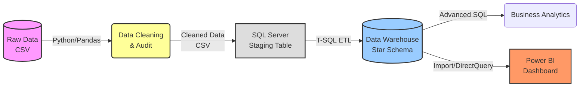

# **🛍️ Phân Tích Dữ Liệu & Hành Vi Khách Hàng E-Commerce (End-to-End Analytics)**

## **🔎 1. Tổng quan dự án (Project Overview)**

Dự án này là một **giải pháp phân tích dữ liệu toàn diện (Full-Stack Data Solution)** cho doanh nghiệp thương mại điện tử dựa trên tập dữ liệu lịch sử năm 2018 (hơn 51,000 đơn hàng). Quy trình triển khai chuyên nghiệp và khép kín qua 4 trụ cột cốt lõi:

| Trụ cột | 1. Xử lý Dữ liệu (Python) | 2. Xây dựng Data Warehouse | 3. SQL Advanced Analytics | 4. Power BI Dashboard |
| :--- | :--- | :--- | :--- | :--- |
| **Công cụ** | Pandas, Jupyter Notebook | SQL Server, T-SQL, ETL, 3NF | Window Functions, CTE | Power BI, DAX, Dark-Mode UI |

### **Sơ đồ luồng dữ liệu (Data Pipeline Architecture)**

> 💡 **Lưu ý dành cho Nhà tuyển dụng / Technical Reviewer:**
> File `README.md` này đóng vai trò là **Báo cáo tổng quan**. Bạn có thể truy cập chi tiết mã nguồn và tài liệu từng phần thông qua bảng liên kết nhanh dưới đây:

| Phân khu | Mô tả chi tiết | Liên kết nhanh |
| :--- | :--- | :--- |
| **1. Python Data Prep** | File Jupyter Notebook làm sạch dữ liệu, kiểm toán chất lượng | [notebooks/](./notebooks/) |
| **2. Kiến trúc & Model** | Từ điển dữ liệu, sơ đồ ERD, thiết kế Star Schema | [docs/](./docs/) |
| **3. Báo cáo Data Audit**| Tóm tắt chất lượng dữ liệu ban đầu và Business Insights | [reports/](./reports/) |
| **4. Database & ETL** | Mã SQL tạo Schema chuẩn 3NF và luồng nạp dữ liệu ETL | [sql/](./sql/) |
| **5. Power BI** | File Dashboard .pbix và Hướng dẫn thiết kế Premium UI/UX | [dashboard/](./dashboard/) |

---

## **🎯 2. Mục tiêu dự án (Objectives)**

*   **Làm sạch & Kiểm toán Dữ liệu:** Xử lý triệt để các giá trị thiếu (missing values), dữ liệu rác từ tập dataset thô bằng Python (Pandas) để đảm bảo chất lượng dữ liệu đầu vào.
*   **Xây dựng Kho dữ liệu (Data Warehouse):** Thiết kế mô hình dữ liệu quan hệ (Star Schema) và phát triển kịch bản ETL tự động đẩy dữ liệu từ CSV vào SQL Server.
*   **Phân tích Kinh doanh Đa chiều:** Truy xuất các chỉ số tài chính, tối ưu vận hành và hành vi mua sắm thông qua các truy vấn SQL nâng cao.
*   **Trực quan hóa cấp C-Level:** Thiết kế Dashboard tương tác mang phong cách hiện đại (Dark-Mode, Glassmorphism) giúp Giám đốc và Quản lý dễ dàng đưa ra quyết định dựa trên dữ liệu (Data-driven decision making).

---

## **🔆 3. Kỹ năng dữ liệu được thể hiện (Skills Showcased)**

| Vai trò | Công cụ & Kỹ thuật áp dụng |
| :--- | :--- |
| **1. Data Engineering (ETL)** | Xây dựng luồng `BULK INSERT`, xử lý Staging Table, thiết kế Star Schema chuẩn 3NF trên SQL Server. |
| **2. Data Cleaning & Audit** | Sử dụng Python Pandas (`.isna()`, `.fillna()`, `.groupby()`) để kiểm toán cấu trúc và làm sạch 51,290 dòng. |
| **3. Advanced SQL** | Ứng dụng Window Functions, CTE, Subqueries để khai thác Insight kinh doanh chuyên sâu. |
| **4. BI & Data Visualization** | Viết DAX nâng cao (AOV, MoM Growth, Time Intelligence) và thiết kế UI/UX Premium trên Power BI. |

---

## **📌 4. Quy trình thực hiện (Implementation Process)**

### **4.1. Khám phá và Làm sạch Dữ liệu (Python Pandas)**
Thay vì đưa thẳng dữ liệu thô vào SQL, dữ liệu được kiểm toán chặt chẽ bằng Python. Các giá trị Null/Missing ở cột quan trọng được xử lý bằng phương pháp Median/Mode, đồng thời tạo thêm Surrogate Key tự động cho các bảng để phục vụ Data Warehouse.
> 📁 **Mã nguồn:** [`notebooks/`](./notebooks/)

### **4.2. Xây dựng Data Warehouse & Luồng ETL (SQL Server)**
Mô hình dữ liệu phẳng (Flat-file) được bóc tách thành **Star Schema** gồm 3 bảng Dimension (`dim_customer`, `dim_product`, `dim_date`) và 1 bảng Fact (`fact_sales`). Kịch bản T-SQL đẩy dữ liệu từ Staging vào các bảng chuẩn hóa giúp loại bỏ dư thừa và tăng hiệu năng truy vấn.
> 📁 **Mã nguồn:** [`sql/01_create_schema.sql`](./sql/01_create_schema.sql) và [`sql/02_etl_pipeline.sql`](./sql/02_etl_pipeline.sql)

*(⚠️ Lưu ý dành cho Reviewer: Khi test script ETL, vui lòng thay đổi đường dẫn Absolute Path tới file CSV trên máy của bạn).*

### **4.3. Phân tích Dữ liệu Nâng cao (Advanced SQL)**
Giải quyết các bài toán vận hành thực tế bằng T-SQL:
* Phân tích biên lợi nhuận và doanh thu theo thời gian.
* Lọc danh sách Top Khách Hàng VIP.
* Phân tích cước phí vận chuyển và thời gian giao hàng (Aging).
> 📁 **Mã nguồn:** [`sql/04_business_analytics.sql`](./sql/04_business_analytics.sql)

### **4.4. Trực quan hóa Dữ liệu (Power BI Dashboard)**
Điểm nhấn sáng tạo của dự án nằm ở Dashboard. Giao diện được thiết kế phá cách với nền **Dark-Mode**, kỹ thuật **Card Layout** đổ bóng tự nhiên, tích hợp **Heatmap Scatter Plot** phân tích khuyến mãi và dải Data Bars lồng trong ma trận, vượt xa các báo cáo truyền thống.
> 📁 **Chi tiết thiết kế:** [`dashboard/UI_UX_TUTORIAL.md`](./dashboard/UI_UX_TUTORIAL.md)

---

## **🚀 5. Lời kết và Đề xuất Kinh doanh (Business Recommendations)**

Dựa trên Dashboard và SQL Analytics, đây là 3 Insight nổi bật đúc kết được:
1.  **Mũi nhọn doanh thu:** Ngành hàng `Fashion` và `Auto & Accessories` là "con bò vắt sữa", chiếm tỷ trọng doanh thu lớn nhất. Cần tập trung ngân sách Marketing vào 2 ngành này.
2.  **Rủi ro Khuyến mãi (Bẫy thanh khoản):** Phân tích Scatter Plot chỉ ra rằng ở các mức giảm giá sâu (>30%), biên lợi nhuận bắt đầu rơi tự do vào vùng âm. Cần siết chặt chính sách mã giảm giá và tính toán lại giá cost.
3.  **Hành vi khách hàng:** Khách hàng sử dụng thiết bị `Web` mang lại doanh thu gấp nhiều lần so với `Mobile`. Đề xuất UI/UX team tối ưu hóa luồng thanh toán trên App di động để ngăn chặn tỉ lệ rớt đơn (Drop-off rate).

*(Xem chi tiết báo cáo tại [`reports/business_recommendations.md`](./reports/business_recommendations.md))*
