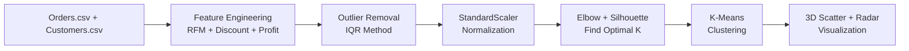
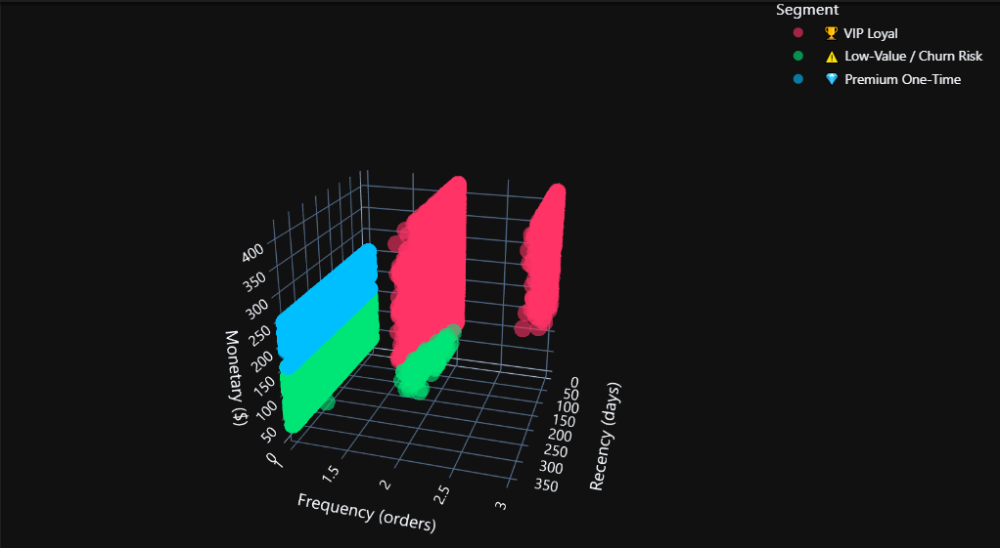
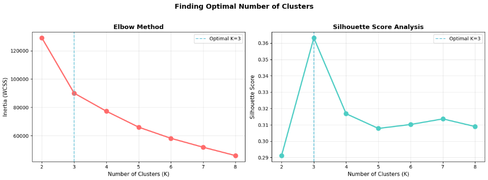

# 🧠 Machine Learning — Customer Segmentation (K-Means Clustering)

## Tổng quan

Module này áp dụng thuật toán **K-Means Clustering** (Unsupervised Learning) để phân khúc ~39,000 khách hàng E-Commerce thành các nhóm hành vi mua sắm rõ rệt dựa trên phân tích **RFM (Recency, Frequency, Monetary)**.

## Quy trình thực hiện



## Đặc trưng (Features) sử dụng

| Feature | Công thức | Ý nghĩa |
| :--- | :--- | :--- |
| **Recency** | Ngày cuối dataset − Ngày mua gần nhất | Bao lâu chưa quay lại? |
| **Frequency** | count(Order_Id) per customer | Mức độ trung thành? |
| **Monetary** | sum(Sales) per customer | Tổng chi tiêu? |
| **Avg_Discount** | mean(Discount) per customer | Mức độ phụ thuộc giảm giá? |
| **Avg_Profit** | mean(Profit) per customer | Lợi nhuận trung bình mang lại? |

## Kết quả phân cụm (3 Segments)

| Segment | Đặc điểm | Chiến lược Marketing |
| :--- | :--- | :--- |
| 🏆 **VIP Loyal** | Frequency cao, Monetary lớn, Recency thấp | Loyalty Club, ưu đãi VIP, chăm sóc cá nhân hóa |
| 💎 **Premium One-Time** | Monetary lớn nhưng mua ít lần, lâu chưa quay lại | Win-back campaign, Cross-sell, mã giảm giá giới hạn |
| ⚠️ **Low-Value / Churn Risk** | Tất cả chỉ số đều thấp | Tự động hóa voucher xả kho, kiểm soát ROI |

### **Mô hình trực quan (Visualizations)**
*Không gian 3D biểu diễn 3 cụm khách hàng phân tách rõ rệt dựa trên mô hình RFM:*


*Đồ thị đánh giá chất lượng thuật toán (Tìm K tối ưu):*


## Công cụ sử dụng

- **Python 3.11+** — Ngôn ngữ lập trình chính
- **Pandas / NumPy** — Xử lý dữ liệu
- **Scikit-Learn** — StandardScaler, KMeans, Silhouette Score
- **Plotly** — 3D Scatter Plot, Radar Chart, Donut Chart
- **Matplotlib / Seaborn** — Distribution plots, Elbow/Silhouette charts

## Cách chạy

```bash
# 1. Cài đặt thư viện
pip install -r ../requirements.txt

# 2. Mở Jupyter Notebook
jupyter notebook customer_segmentation.ipynb
```
